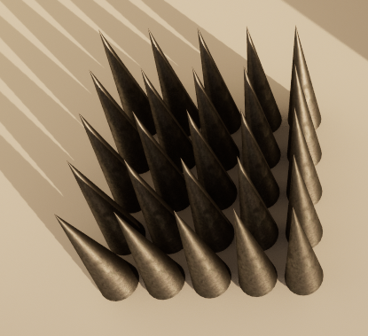
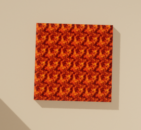
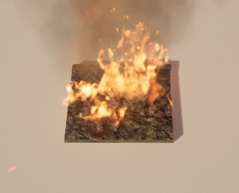
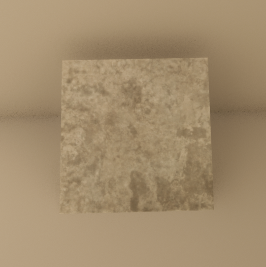
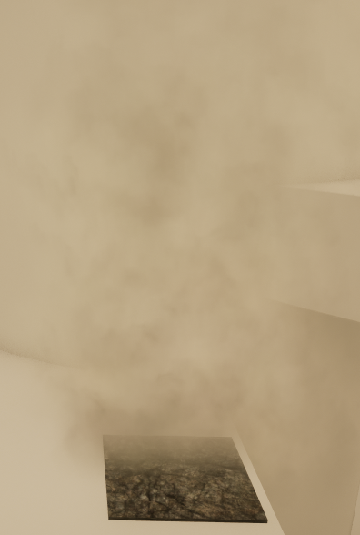

Platformer Blueprint
==========================

Presentation
------------
Platformer created with Unreal Engine 5,\
using Blueprints and base assets only.

Goal
----------

Overcome the obstacles and deal with the enemies to reach the golden flag. 

Enemies
---------------------------------------------------
- Weak:\

- Strong:\

*I use an actor "WeakPoint" (sphere collider) to detect collision with character's feet (PlaneCollider). On both of these enemies, it is place on top.*

Traps
-----
- Spikes:\
Constant damage, small bounce.\

- Lava:\
Constant damage, high bounce.\

- Flame:\
Damage over Time, high bounce.\
Alternates between 3 states: inactive, warning (smoke), active(fire).\

Mobility props
--------------
- Bumper:\
Bumps you over its up vector.\

- Wind:\
Pushes you up while on it.\
Alternates between 2 states: inactive, active.\

Difficulties
-----------

- The relationship between parent child isn't very direct, I had a hard time adapting my logic to this. Child actors' variables must be manually set in the event graph of the parent to be tweakable int the editor.

- No Collision "stay" fuction, had to create my own for flame traps/ wind tiles: with a timed tick, using list of actors(characters) of Get Overlapping Actors.

- I wanted to use te geometry brush for Actor Meshes, but the two Objects are incompatible; As a result I used groups to move the "Infernal Tower"(endgame part), which wasn't optimal - no common postion for ~300 actors.

Task repartiton:
---------------

### Yohann:
- Enemy behaviour
- Animation Character
- Level Design
- Checkpoints and mobile platforms

### Felix:

- Character Graph
- Props: Traps, bumper...
- Health System (player and enemies)
- Collectibles: "hearts"
- UI
- Some visual features: lava effect, wind, blinking on damage ...

